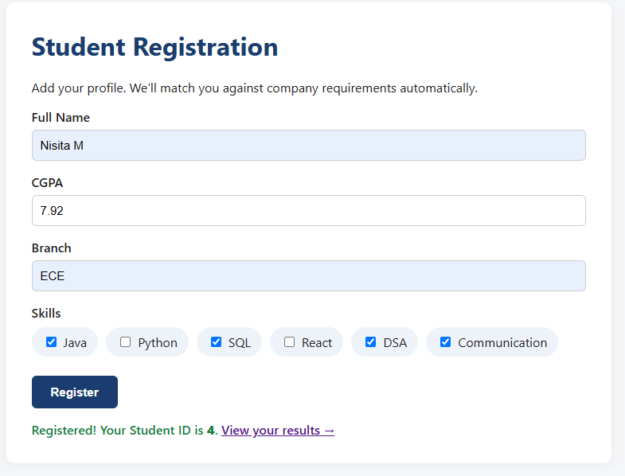

# Smart Placement Recommendation System

A full-stack Java web application that matches student profiles against
company hiring criteria and recommends the best-fit companies using a
custom scoring algorithm.

## Features
- Eligibility checking based on CGPA and required skills
- Scoring algorithm to rank eligible companies
- REST-style JSON APIs via Java Servlets
- MySQL database with JDBC
- Deployed on Apache Tomcat

## Tech Stack
Java, Servlets, JDBC, MySQL, HTML/CSS/JavaScript, Apache Tomcat

## Screenshots

**Student Registration**

**Dashboard**

**Eligibility Results**

## How it works
1. Student registers with name, CGPA, branch, and skills
2. System compares profile against each company's requirements
3. Returns eligible companies, ineligible companies (with reasons),
   and ranked recommendations based on a scoring algorithm
